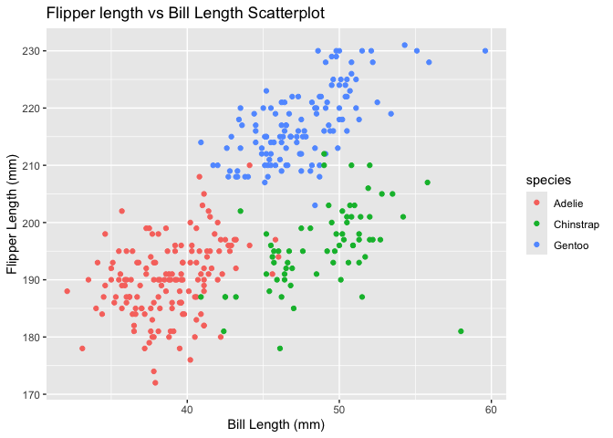

p8105_hw1_lmp2234
================
Lisa Pardee
2024-09-21

\##Problem 1

``` r
library(palmerpenguins)

data("penguins",package="palmerpenguins")

row_num<-nrow(penguins)
col_num<-ncol(penguins)

mean_flipper<-mean(penguins$flipper_length_mm, na.rm = TRUE)
```

**The penguins data set contains information about different species of
penguins and their characteristics. The variables include species,
island, bill length, bill depth, flipper length, body mass index, sex,
and year. The dataset has 344 rows and 8 columns. The mean flipper
length is 200.9152047 mm.**

``` r
library(tidyverse)
```

    ## ── Attaching core tidyverse packages ──────────────────────── tidyverse 2.0.0 ──
    ## ✔ dplyr     1.1.4     ✔ readr     2.1.5
    ## ✔ forcats   1.0.0     ✔ stringr   1.5.1
    ## ✔ ggplot2   3.5.1     ✔ tibble    3.2.1
    ## ✔ lubridate 1.9.3     ✔ tidyr     1.3.1
    ## ✔ purrr     1.0.2     
    ## ── Conflicts ────────────────────────────────────────── tidyverse_conflicts() ──
    ## ✖ dplyr::filter() masks stats::filter()
    ## ✖ dplyr::lag()    masks stats::lag()
    ## ℹ Use the conflicted package (<http://conflicted.r-lib.org/>) to force all conflicts to become errors

``` r
library(ggplot2)

set.seed(1234)

ggplot(penguins, aes(x=bill_length_mm, y = flipper_length_mm, color = species)) + 
  geom_point() +
  labs(title = "Flipper length vs Bill Length Scatterplot", 
      x = "Bill Length (mm)",
      y = "Flipper Length (mm)")
```

    ## Warning: Removed 2 rows containing missing values or values outside the scale range
    ## (`geom_point()`).

<!-- -->

``` r
ggsave("scatter_plot.pdf", height = 4, width =6)
```

    ## Warning: Removed 2 rows containing missing values or values outside the scale range
    ## (`geom_point()`).

\##Problem 2

``` r
library(tidyverse)
set.seed(123)

problem2_df <- tibble(
  normal_sample = rnorm(10), 
  log_vector = rnorm(10) > 0, 
  char_vector = sample(letters[1:3], 10, replace = TRUE), 
  factor_vector = factor(sample(c("Level1","Level2", "Level3"),10, replace = TRUE)))
  
problem2_df
```

    ## # A tibble: 10 × 4
    ##    normal_sample log_vector char_vector factor_vector
    ##            <dbl> <lgl>      <chr>       <fct>        
    ##  1       -0.560  TRUE       c           Level3       
    ##  2       -0.230  TRUE       b           Level1       
    ##  3        1.56   TRUE       a           Level3       
    ##  4        0.0705 TRUE       c           Level2       
    ##  5        0.129  FALSE      a           Level1       
    ##  6        1.72   TRUE       a           Level2       
    ##  7        0.461  TRUE       b           Level1       
    ##  8       -1.27   FALSE      c           Level1       
    ##  9       -0.687  TRUE       c           Level3       
    ## 10       -0.446  FALSE      a           Level1

``` r
mean_normal <- mean(pull(problem2_df,normal_sample))
mean_logical <- mean(pull(problem2_df,log_vector))
mean_char <- mean(pull(problem2_df,char_vector))
```

    ## Warning in mean.default(pull(problem2_df, char_vector)): argument is not
    ## numeric or logical: returning NA

``` r
mean_factor <- mean(pull(problem2_df,factor_vector))
```

    ## Warning in mean.default(pull(problem2_df, factor_vector)): argument is not
    ## numeric or logical: returning NA

``` r
mean_normal
```

    ## [1] 0.07462564

``` r
mean_logical
```

    ## [1] 0.7

``` r
mean_char
```

    ## [1] NA

``` r
mean_factor
```

    ## [1] NA

**Taking the mean of the normal and logical vector works. However,
taking the mean of the character and factor vectors does not work.**

``` r
numeric_logical <- as.numeric(pull(problem2_df,log_vector))
numeric_char <- as.numeric(pull(problem2_df,char_vector))
```

    ## Warning: NAs introduced by coercion

``` r
numeric_factor <- as.numeric(pull(problem2_df,factor_vector))
```

**When as.numeric is applied to the logical vector, TRUE corresponds to
1 and FALSE corresponds to 0. This enables the mean to be computed when
converted as it is now numeric.**

**When as.numeric is applied to the character vector, all values turn
into NA. R is not able to turn non-numeric characters into numeric
values which means the mean cannot be calculated.**

**When as.numeric is applied to the factor vector, the levels become
numeric. However, it is not clear which level corresponds to which
number, so although mean can be calculated, it may not be interpreted
correctly.**
